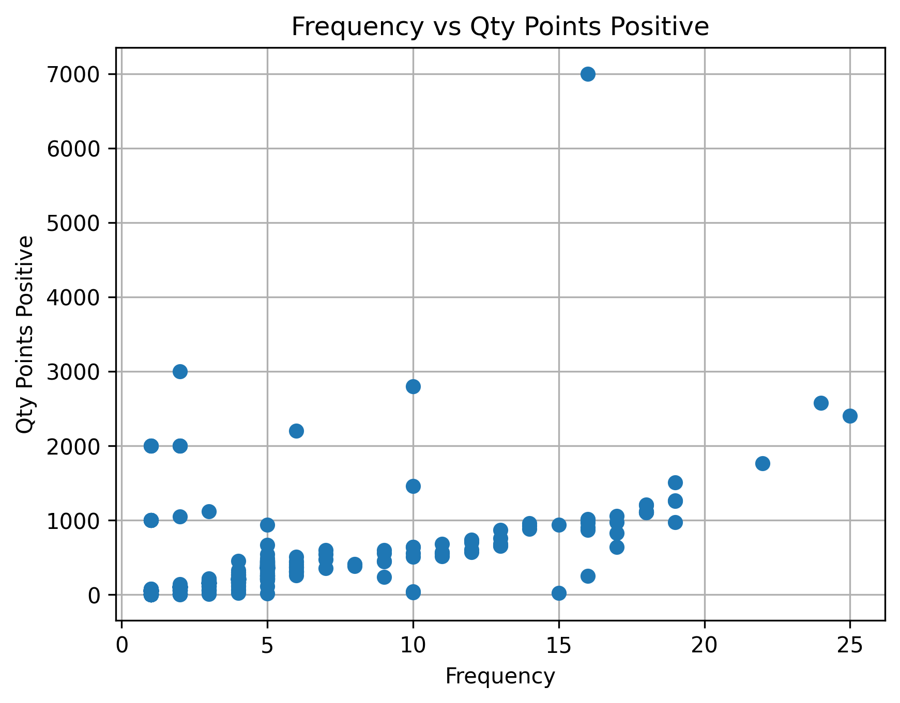
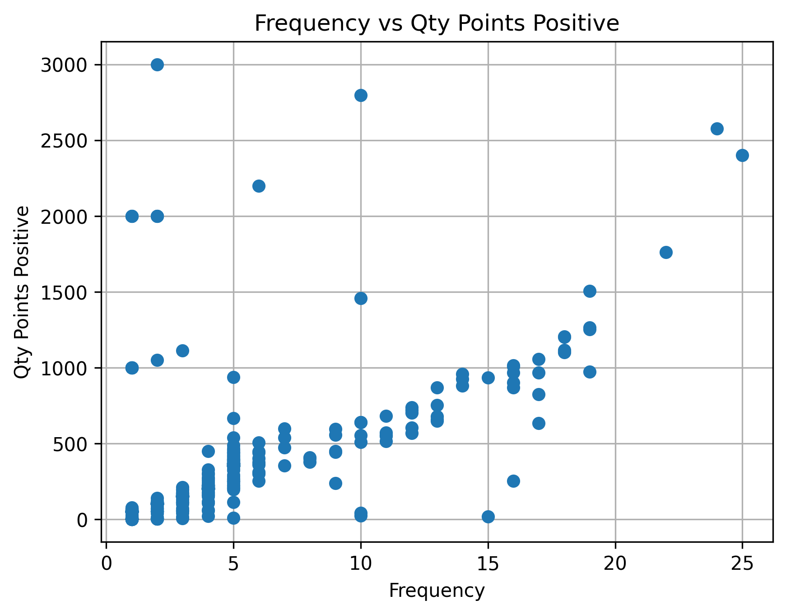
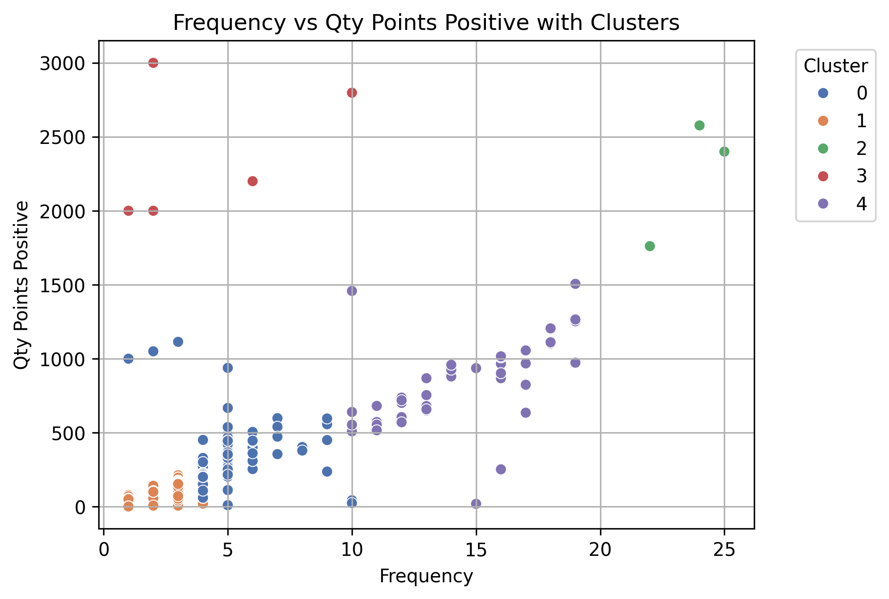
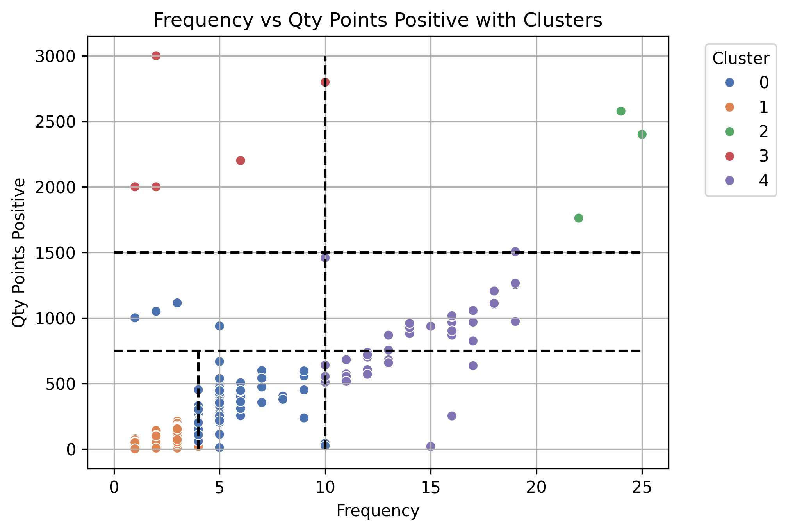
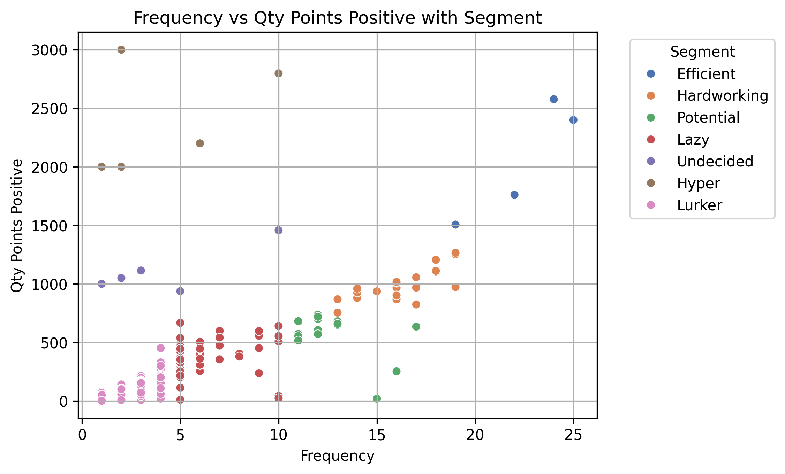

# Project Loyalty Predict [2025]

Using TeoMeWhy's Loyalty program to create a Data Science project.

You can check TeoMeWhy's material [cursos.teomewhy.org](https://cursos.teomewhy.org) (pt-br).

 

# Table of Contents

- [Objective](#objective)
- [Actions](#actions)
- [Requirements](#requirements)
- [Steps](#steps)
- [Data Source](#data-source)

## Objective

Identify user engagement (gain/loss) in TeoMeWhy's community.

## Actions 

## Requirements

## Steps

## Data Source

- [Loyalty System](https://www.kaggle.com/datasets/teocalvo/teomewhy-loyalty-system)
- [Education Platform](https://www.kaggle.com/datasets/teocalvo/teomewhy-education-platform) 

 

# EDA

Understanding the data and what is happening to the community engagement.
Good metrics to check is:

- DAU: Daily Active Users
- MAU: Monthly Active Users
- MAU 28 days: Monthly Active User in a 28 days period, or 4 weeks, this way we have a better comparable months, as all weekdays will have the same representativity.

## DAU

With the DAU metric we want to check how many people is engaged on a daily cadence.

🗨️<b>Notes:</b> \
<i>Notice the high peaks that coincides with Teo's launch course days.
Last one was in Semptember 2025 representing the higher peak.
Another observation here is days that get closer to 0.
It was explained that the tracking system was not live on weekends so it would be somewhat rare to have 0 on certain periods.
Now, their bot is working 24/7 and users can go there even when there is no live streaming just to farm points.</i>

## MAU

MAU metric will smooth out the daily noise.

🗨️<b>Notes:</b> \
<i>Notice the high peaks in the begining of each year, when people are possibly thinking about changing careers and start watching Teo's courses.
Things seems to not get better as we see a decrease in engagement towards the end of the year.
In September 2025, Teo's SQL course was a success in engagement.</i>

## MAU 28 Days before

With MAU windowed 28 days we have months that are comparable with the same number of weekdays.

🗨️<b>Notes:</b> \
<i>The chart is similar to the DAU chart, but now we don't have the noise of 0.
This way we can see how many followers remain on that that and the previous 27 days.
Starting of the year attracting more followers as we have mentioned, and then it drops towards the end. 
Look how in 2025 the numbers have been going sideways.
Teo needs to keep his followers engaged in the community.</i>

## Follower Life Cycle

There is the need to understand how followers behave in the community. 
The scheme below was talked during the course day and consider how the business sees the engagement churn. 
All naming was roughtly translated and since Teo is know as "The Data Wizzard", we have decided to change the names a little, using this magic concept.

Definitions:
- curious -> age < 7 days
- faithful -> recency < 7 days AND previous recency < 14 days
- tourist -> 7 <= recency <= 14 days
- unenchanted -> 14 < recency <= 28 days
- zombie -> recency > 28 days
- reconquered -> recency < 7 days AND 14 <= previous recency <= 28 days
- reborn -> recency < 7 days AND previous recency > 28 days

 

| Teo's Name | Business Name | Magical Name | Logic |
| ---------- | ------------- | ------------ | ----- |
| Curious | Acquired | Apprendice | age < 7 days |
| Faithful | Retained / Core | Sorcerer | recency < 7 days AND previous recency < 14 days |
| Tourist | Light / Passive | Wondered | 7 <= recency <= 14 days |
| Unenchanted | Churning / Dormant | Fading | 14 < recency <= 28 days |
| Zombie | Lapsed / Inactive | Petrified | recency > 28 days |
| Reconquered | Recovered | Reawakened | recency < 7 days AND 14 <= previous recency <= 28 days |
| Reborn | Resurrected | Resurrected | recency < 7 days AND previous recency > 28 days |

 

🗨️<b>Notes:</b> \
<i>Looking at all the stages that a user can be in the database, except for Zombie/Petrified, Teo's followers are not new.
Except at end of August 2025 when we already knew many new comers/Apprendice came for his SQL course, most of his followers are Faithful/Sorcerer.
And even the Apprendices that came in Aug/2025 remained in Sep/2025, as the Sorcerer bar has increased a little.</i>

## Frequency & Value

For the logic of the analysis, let's only consider positive points, as we want to see how followers are engaging in the channel.

🗨️<b>Notes:</b> \
<i>look how there is a isolated point with ~7K points.
According to the business, they know this is an error, when other followers made a negative transaction, that same amount was given in absolute to another follower. And always the same follower.
The best course of action here is remove this user from our analysis as we knoe it was a bug in Teo's point system.</i>

 

After removing that one outlier (bug), now we can see the real dispersion of users and their positive points.

## Clustering

In order to run a cluster we **need** to standardize our data first.
A simple MinMax would be good to put both variables in the same scale.
Then we can use Non-Hierarchical clustering method (Kmeans) to segment out users.

🗨️<b>Notes:</b> \
<i>Each random_state (seed) hyperparameter will generate a different cluster grouping.
It is up to you to create the segmentation you can explain to the business.
You can use the cluster output to configure your own segmentation, this way you can explain and create the rules easily without relying on running clusters on new databases.</i>

### Segmentation Rules

Based on the conversation with the business, and what makes sense to this project, we decided to create some segment rules using the cluster as a baseline point.
The idea here is to identify Teo's followers' behavior and see how can an action can be implemented to retain more followers and to keep them engaged.
We will use this rules in out SQL code.

🗨️<b>Notes:</b> \
<i>It is a good practice to not overdo the number of segments here.
Remember that this segments will work together with the life cycle groups (7) we have created.
So, if in this segmentation part we have another 7 groups, in total we have 49 combinations possible.
It seems too many groups for later on, Teo create a retention program of some sort.</i>

 

We have now created segment rules on SQL in this order:

| Number (FreqValue) | Segment Name | Segment Rule |
| ------------------ | ------------ | ------------ |
| 12 | Hyper | Frequency > 10 & QtyPointsPositive ≥ 1500 |
| 22 | Efficient | Frequency > 10 & QtyPointsPositive ≥ 1500 |
| 11 | Undecided | Frequency ≤ 10 & QtyPointsPositive ≥ 750 |
| 21 | Hardworking | Frequency > 10 & QtyPointsPositive ≥ 750 |
| 00 | Lurker | Frequency < 5 |
| 01 | Lazy | Frequency ≤ 10 |
| 20 | Potential | Frequency > 10 |

🗨️<b>Notes:</b> \
<i>And now we have our segments hard coded in SQL.
The idea is also not having "Petrified/Zombie" part of that segmentation.</i>

## Business Discussion

Let's look at the life cycle stages on Teo's followers from August/2025 (excluding "Petrified/Zombies").

| DtRef      | descLifeCycle  | QtyFollowers | % Followers |
| ---------- | -------------- | ------------ | ----------- |
| 2025-08-31 | 01-Apprendice  | 391          | 53.93       |
| 2025-08-31 | 02-Sorcerer    | 170          | 23.45       |
| 2025-08-31 | 02-Resurrected | 57           | 7.86        |
| 2025-08-31 | 04-Fading      | 56           | 7.72        |
| 2025-08-31 | 03-Wondered    | 39           | 5.38        |
| 2025-08-31 | 02-Reawakened  | 12           | 1.66        |

This table shows that 23.45% of his followers are in the engagement category we would want them to be: **Sorcerer**.
And that is a very small portion. \
Knowing this, Teo is thinking about creating a model that would help him understand which of the groups or group segments he can touch to get his followers more engaged and make them become **Sorcerers**.

### Objective of this project

Understand how Teo's followers can become Sorcerers.

