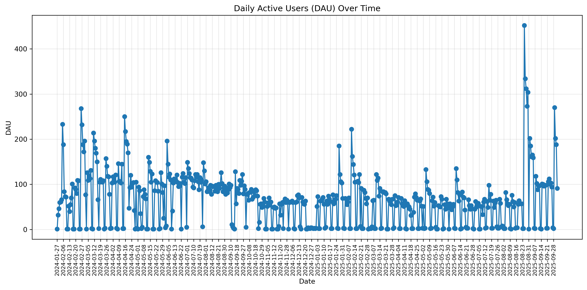
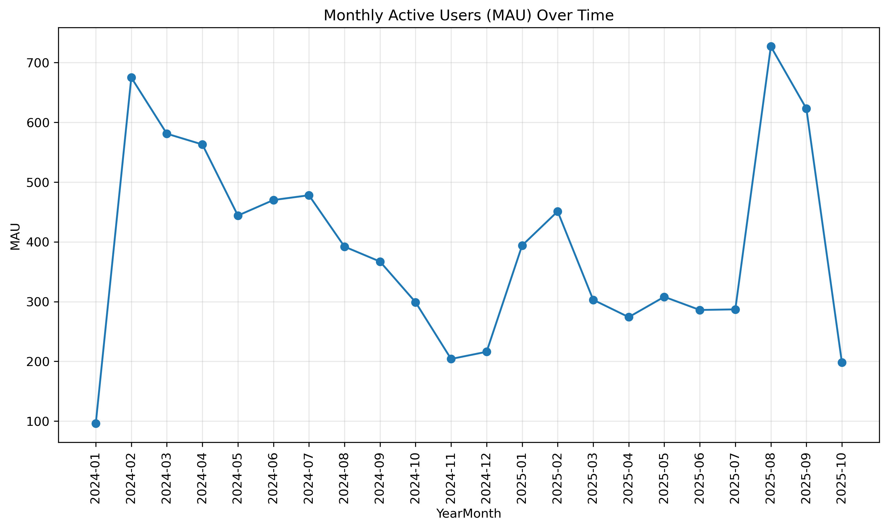
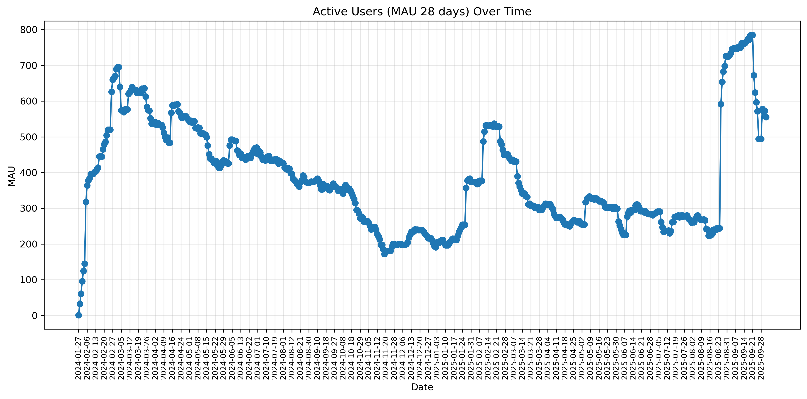

# Project Loyalty Predict [2025]

Using TeoMeWhy's Loyalty program to create a Data Science project.

You can check TeoMeWhy's material [cursos.teomewhy.org](https://cursos.teomewhy.org) (pt-br).

# Table of Contents

- [Objective](#objective)
- [Actions](#actions)
- [Requirements](#requirements)
- [Steps](#steps)
- [Data Source](#data-source)

## Objective

Identify user engagement (gain/loss) in TeoMeWhy's community.

## Actions 

## Requirements

## Steps

## Data Source

- [Loyalty System](https://www.kaggle.com/datasets/teocalvo/teomewhy-loyalty-system)
- [Education Platform](https://www.kaggle.com/datasets/teocalvo/teomewhy-education-platform) 

---

# EDA

Understanding the data and what is happening to the community engagement.
Good metrics to check is:

- DAU: Daily Active Users
- MAU: Monthly Active Users
- MAU 28 days: Monthly Active User in a 28 days period, or 4 weeks, this way we have a better comparable months, as all weekdays will have the same representativity.

## DAU

With the DAU metric we want to check how many people is engaged on a daily cadence.

🗨️<b>Notes:</b>
Notice the high peaks that coincides with Teo's launch course days. Last one was in Semptember 2025 representing the higher peak. Another observation here is days that get closer to 0. It was explained that the tracking system was not live on weekends so it would be somewhat rare to have 0 on certain periods. Now, their bot is working 24/7 and users can go there even when there is no live streaming just to farm points.
 

## MAU

MAU metric will smooth out the daily noise.

🗨️<b>Notes:</b>
Notice the high peaks in the begining of each year, when people are possibly thinking about changing careers and start watching Teo's courses. Things seems to not get better as we see a decrease in engagement towards the end of the year.
In September 2025, Teo's SQL course was a success in engagement.
 

## MAU 28 Days

With MAU windowed 28 days we have months that are comparable with the same number of weekdays.

🗨️<b>Notes:</b>
The char is similar to thr DAU chart, but now we don't have the noise of 0. This way we can see how many users remain on that that and the previous 27 days.
Starting of the year attracting more users as we have mentioned, and then it drops towards the end. 
Look how in 2025 the numbers have been going sideways. Teo needs to keep his users engaged in the community.

